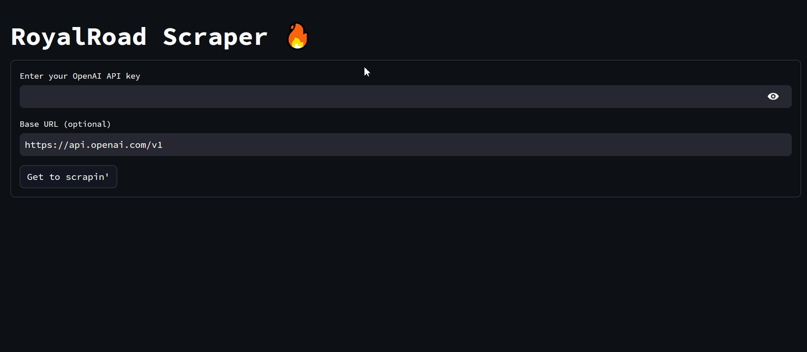
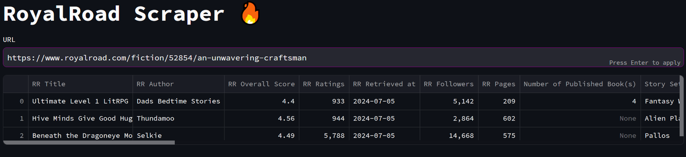
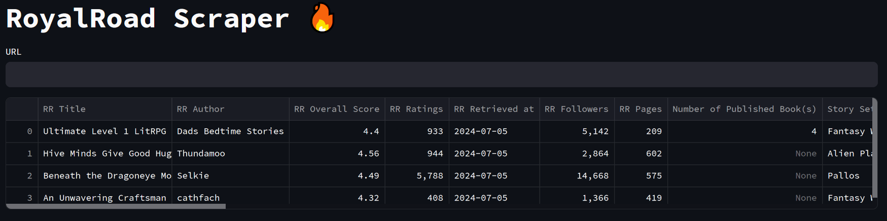

# rrscrape

`rrscrape` is a tool built for scraping and extrapolating data from RoyalRoad, a popular platform for publishing web serials, primarily in the progression fantasy genre.
#### Repository Structure:
```
<project_root>
├── README.md
├── assets
│   ├── colab_streamlit.ipynb
│   ├── demo.gif
│   ├── demo1.png
│   └── demo2.png
├── pyproject.toml
├── rrscrape
│   ├── __init__.py
│   ├── app.py
│   ├── consts.py
│   ├── general_utils.py
│   ├── scrape-dev
│   │   ├── images.py
│   │   └── scrape_amazon.py
│   ├── scrape.py
│   └── .streamlit
│       └──    ...
├── .git
│   └──    ...

```
## Features

- **RoyalRoad Scraping**: Scrape detailed information from RoyalRoad story pages, including titles, authors, ratings, and other stuff.
- **Data Enrichment**: Utilize OpenAI's GPT models to infer missing metadata and enrich the dataset. 
  - Also supports OpenRouter or any other OpenAI-like API.

## Intention

I made this project to help an author whose podcast I like. 

(shoutout [Madix-3](https://www.royalroad.com/profile/244942) and his remarkable [CritRPG podcast](https://www.youtube.com/@critrpg)) 

I also wanted to practice using chat APIs and the streamlit library. I built this to be very simple and used as a template to build from for myself and beginners.

## Usage

### People who have experience in Python programming:
1. Clone the repository 
2. Install the requirements from `pyproject.toml` using `poetry install`. If you don't use poetry, you can look at the `pyproject.toml` file to see what libraries you need to install with pip under `[tool.poetry.dependencies]`.
3. Run the web UI by entering `streamlit run app.py` in the terminal while it's open in the project directory.

### People who don't have experience in Python programming:
1. Download the repository as a zip file by clicking the green "Code" button and selecting "Download ZIP".
2. Unzip the project folder on your computer.
3. Go to [this Google Colab notebook](https://colab.research.google.com/drive/1rGTMKkyw6WnKX7vH18GosOu6YRc3BxCZ?usp=sharing) and follow the instructions there. A copy of the notebook is also included in the project folder as `colab_streamlit.ipynb`.

## Usage Examples:



